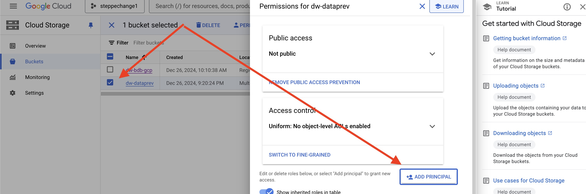
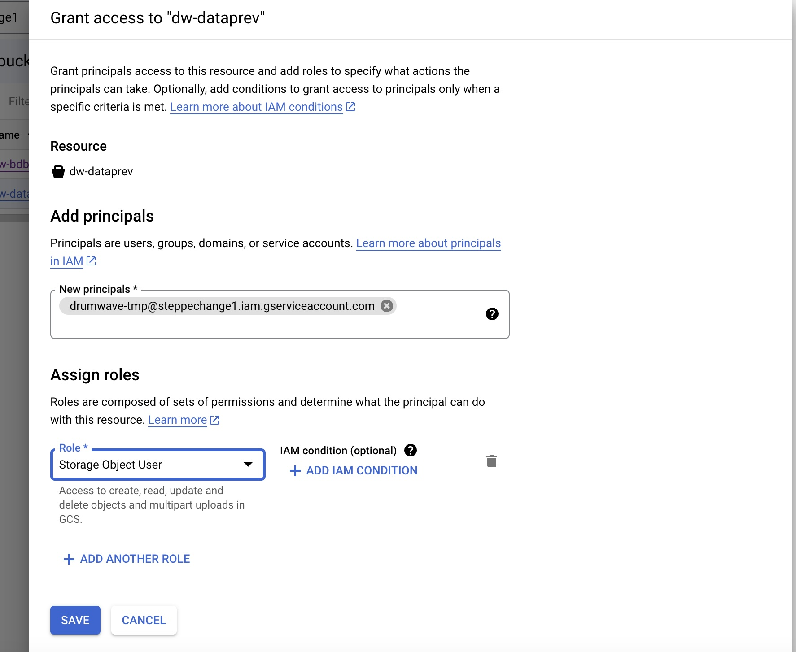

# GCP scripts

This contains scripts to help use parquet files from [GCP GCS](https://cloud.google.com/storage)

## Prerequisites

 * [AWS CLI](https://aws.amazon.com/cli/)
 * [Google Cloud CLI](https://cloud.google.com/sdk/docs/install)
 * `~/.aws/config` file that contains a section as follows

```
[profile main-profile]
sso_start_url = https://d-0000000000.awsapps.com/start
sso_region = us-east-1
sso_account_id = 000000000000
sso_role_name = AdministratorAccess
region = us-east-1
```

## Configure GCP account

1. Follow steps in [this document](https://aws.amazon.com/blogs/big-data/use-amazon-athena-to-query-data-stored-in-google-cloud-platform/) under "Google Cloud Platform configuration" section to

  * Create a bucket and load Parquet files.
  * Create Google service account
  * Generate key for the account. For the sake of this example it will be `tmp/gcp/key`.

For the sake of this example, the file will be `gs://customer3/customer3/customer3.parquet`

**NOTE** This assumes files are organized as `gs://<bucket-name>/<db-name>/<db-name>.parquet`.

**TODO** Deal with multiple files under `gs://<bucket-name>/<db-name>`.

**STOP AT THE END OF THIS SECTION!!! DO NOT GO ON TO AWS CONFIGURATION!!!**

2. Additionally, navigate to the bucket and add permissions for this service account to access it as follows:

 * Select a bucket and click on "Add principal"



 * Add as principal the service account and grant "Storage Object Viewer" (better) or "Storage Object User" role:



## Setting up this new account in Main account

1. Add the key generated above (a JSON file) into AWS Secrets.

2. Create a file such as [customer3-gcs.json](customer3-gcs.json)

3. Run `create-lambda.sh customer3-gcs.json`

### Note on this step

We create a new lambda per account because we'd need to modify the
source for the connector, because it relies only on environment
variables to get a key. Ideally we don't.  

#### Note this note

On building the JAR used in [connector/docker-build.sh](connector/docker-build.sh):

The jar is built from https://github.com/awslabs/aws-athena-query-federation (forked due to some necessary changes to `pom.xml`) wih Java 21 as follows:

```
mvn clean install -DskipTests

cd athena-gcs

mvn clean install -DskipTests
```

## Adding new table

Run `setup-glue.sh customer3-gcs.json`.


